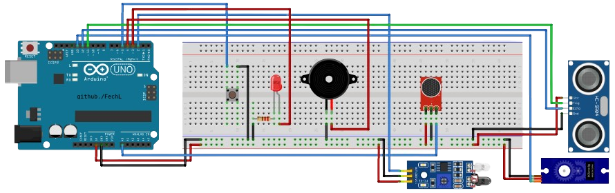
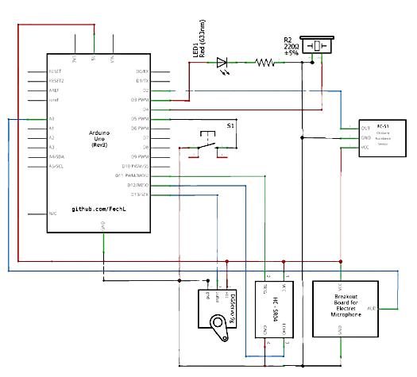

# Arduino Security Prototype

## Overview
This project implements an ultrasonic radar system using Arduino for hardware control and Processing for visualization. The system scans surroundings by rotating a servo motor with an ultrasonic sensor and displays detected objects on a radar interface.

Preview video (youtube):
[Simple Arduino Security Prototype](https://youtube.com/shorts/7LaqdOJC4zM?feature=share)

## Features
- 180° area scanning using servo motor rotation
- Distance measurement using ultrasonic sensor
- Sound detection capability
- Light-dependent activation (LDR sensor)
- Visual (LED) and audio (buzzer) warnings
- Timeout warning system with button reset
- Real-time radar visualization interface

## Components
- Arduino board
- Ultrasonic sensor (HC-SR04)
- Servo motor
- Sound sensor
- Light Dependent Resistor (LDR)
- LED
- Buzzer
- Button
- Connecting wires

## Files
- `main.c` - Arduino code for sensor control and data processing
- `radar.java` - Processing code for the radar visualization interface

## Setup Instructions
1. Connect components to Arduino according to defined pin configuration in `main.c`
2. Upload `main.c` to Arduino board
3. Set the correct serial port in `radar.java` (currently "COM5")
4. Run the Processing sketch to start the visualization

## How It Works
- The system activates when sufficient light is detected by the LDR
- The servo rotates between 15° and 115° continuously
- Distance is measured at each angle position
- Warnings are triggered when objects are detected within 10cm or loud sounds are detected
- A timeout warning activates after 5 minutes of operation
- The button resets warnings and timeout

## Board and Scheme

## Visualization Features
- Color-coded radar display (green for radar, red for detected objects)
- Distance markers at 10cm, 20cm, 30cm, and 40cm
- Angle indicators
- Real-time distance and angle measurements
